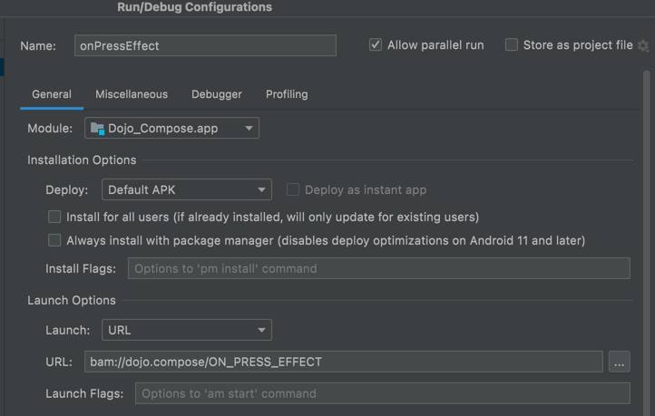
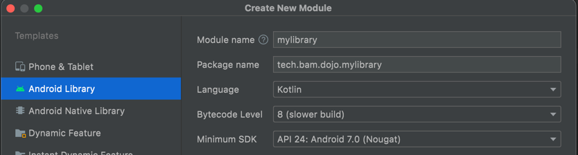

# dojo-compose
Repository to store compose dojo

## set up a dojo workshop (20 min first time then 5 min)

- Follow the "DOJO: STEP" 1 to 3 in the code
- [optional] DOJO: STEP 4 - create a method to launch quickly the current dojo screen
  - 
- DOJO: STEP 5 - add a new android library module to the project
  - right click on the project and select "New" -> "Module"
  - 
  - replace the module build content by the following content: 
    - `apply from: "$rootDir/gradle/baseFeature.gradle"`
  - add some dependencies if needed 
- [optional] DOJO: STEP 6 - prepare some code in the module
- DOJO: STEP 7 - Check it builds then push the code on main branch 
- [mandatory] DOJO: STEP 8 - Have fun
