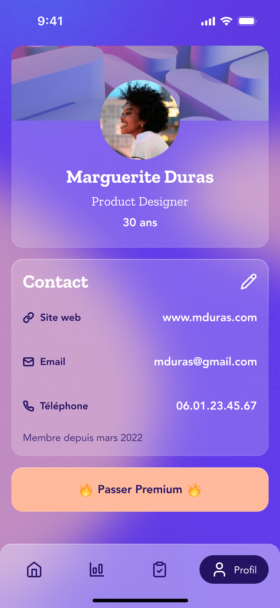

# Apercu

## Expected

## Result

To be done

# But:

Introduire compose multiplateform en implémentant un layout simple:
https://www.figma.com/design/lt8PMrXreI87pmJPkKhcHl/DOJO-UI---For-Dev?node-id=1-501&t=Ag3aDCtJ1RJw4dIS-0

# Déroulement prévisionnel du dojo:

## Eléments non pris en compte

- barre de navigation en bas
- Le background qui fera l'objet d'un dojo à part entière. Mettez juste le
  violet en fond
- Les fonts ne sont pas à prendre en compte
- Les border en gradient ne sont pas à prendre en compte

## Tache a faire

- Mettre les 3 composants en colonne (AvatarCard, ContactCard, PremiumButton)
- Développer la vue du PremiumButton
- Developper la vue de ContactCard
- Developper la vue de AvatarCard

## Bonus

- Utiliser Coil
- border en gradient
- utiliser fleet et avoir des previews qui fonctionnent dans le code common

# Aide

- `Modifier.blur`
- `Modifier.alpha`
- `Card`
- `implementation(compose.materialIconsExtended)`
- (
  Resources)[https://www.jetbrains.com/help/kotlin-multiplatform-dev/compose-images-resources.html#qualifiers]
- Andon Nicolas ACART et Dennis BORDET
